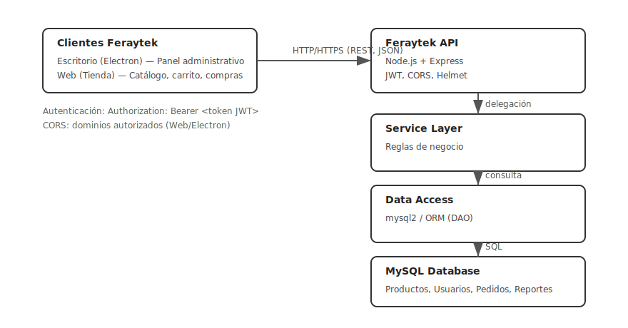

# 🚀 Feraytek API


API backend oficial del ecosistema Feraytek. Orquesta la comunicación entre las aplicaciones cliente (Web y Escritorio) y la base de datos MySQL mediante endpoints REST seguros, autenticación JWT y una arquitectura limpia basada en MVC + Service Layer.

## 📚 Tabla de Contenidos
- [Descripción General](#-descripción-general)
- [Arquitectura de la API](#-arquitectura-de-la-api)
- [Dependencias y Librerías](#-dependencias-y-librerías)
- [Estructura del Proyecto](#-estructura-del-proyecto)
- [Instalación y Configuración](#-instalación-y-configuración)
- [Uso con Docker](#-uso-con-docker)
- [Endpoints Principales](#-endpoints-principales)
- [Integración con las Aplicaciones Cliente](#-integración-con-las-aplicaciones-cliente)
- [Pruebas](#-pruebas)
- [Seguridad](#-seguridad)
- [Autores y Créditos](#-autores-y-créditos)
- [Licencia](#-licencia)
- [Enlaces Oficiales](#-enlaces-oficiales)

> **Backend RESTful API del ecosistema Feraytek** - Núcleo de comunicación entre base de datos MySQL y aplicaciones cliente (Escritorio y Web)


---

## 🧠 Descripción General

La **Feraytek API** es el núcleo del sistema Feraytek, actuando como interfaz de comunicación entre la **base de datos MySQL** y las aplicaciones cliente. Esta API RESTful proporciona servicios de autenticación, gestión de productos, procesamiento de pedidos, estadísticas y administración de usuarios.

### 🔗 Integración del Ecosistema

La API sirve como backend para dos aplicaciones principales:

1. **🖥️ Aplicación de Escritorio (Panel Administrativo)** - Desarrollada con Electron
   - Repositorio: [`Feraytek`](https://github.com/Arhiell/Feraytek.git) <mcreference link="https://github.com/Arhiell/Feraytek.git" index="0">0</mcreference>
   - Funciones: Administración, estadísticas, gestión de inventario

2. **💻 Aplicación Web (Tienda Online)** - Frontend para clientes
   - Repositorio: [`FeraytekWeb`](https://github.com/Arhiell/FeraytekWeb.git)
   - Funciones: Catálogo, carrito de compras, procesamiento de pagos

### 📊 Flujo de Comunicación

```
[Apps Cliente] → HTTP REST → [Controladores] → [Servicios] → [Modelos] → [MySQL Database]
```

---

## 🧱 Arquitectura de la API

Diagrama conceptual (ASCII):

```
                ┌───────────────────────────┐
                │      Clientes Feraytek    │
                │                           │
   ┌────────────┴─────────────┐  ┌──────────┴───────────┐
   │ Escritorio (Electron)    │  │ Web (Tienda Online)  │
   │ Panel administrativo     │  │ Catálogo, carrito     │
   └────────────┬─────────────┘  └──────────┬───────────┘
                │  HTTP/HTTPS (REST, JSON)  │
                └────────────┬──────────────┘
                             ▼
                     ┌─────────────────┐
                     │  Feraytek API   │  Node.js + Express
                     │  (Controllers)  │  JWT, CORS, Helmet
                     └───────┬─────────┘
                             │ delega
                             ▼
                     ┌─────────────────┐
                     │ Service Layer    │  Reglas de negocio
                     └───────┬─────────┘
                             │ consulta
                             ▼
                     ┌─────────────────┐
                     │  Data Access     │  mysql2 / ORM
                     └───────┬─────────┘
                             │ SQL
                             ▼
                     ┌─────────────────┐
                     │     MySQL DB     │
                     └─────────────────┘
```

Diagrama SVG (opcional) para documentación visual:



La API sigue el patrón **MVC + Service Layer** para garantizar escalabilidad y mantenibilidad:

```
┌─────────────────┐    ┌─────────────────┐    ┌─────────────────┐
│   Apps Cliente  │    │   Feraytek API  │    │  MySQL Database │
│                 │    │                 │    │                 │
│ • Electron App  │◄──►│ • Controllers   │◄──►│ • feraytek_db   │
│ • Web App       │    │ • Services      │    │ • Tablas        │
│ • Mobile (fut.) │    │ • Models        │    │ • Relaciones    │
└─────────────────┘    └─────────────────┘    └─────────────────┘
```

### 🔐 Capas de Seguridad

- **Autenticación JWT**: Tokens seguros para sesiones de usuario
- **Middleware de Validación**: Verificación de roles y permisos
- **CORS Configurado**: Acceso restringido a dominios autorizados
- **Encriptación**: Contraseñas hasheadas con bcrypt

---

## ⚙️ Dependencias y Librerías

### 📦 Core Dependencies

```bash
npm install express dotenv mysql2 cors helmet bcrypt jsonwebtoken morgan winston multer uuid cookie-parser
```

### 🛠️ Development Dependencies

```bash
npm install --save-dev nodemon jest supertest
```

### 📋 Descripción de Dependencias

| Librería | Propósito | Versión |
|----------|-----------|---------|
| `express` | Framework web para Node.js | ^4.18.0 |
| `mysql2` | Cliente MySQL con soporte para Promises | ^3.6.0 |
| `jsonwebtoken` | Generación y verificación de JWT | ^9.0.0 |
| `bcrypt` | Encriptación de contraseñas | ^5.1.0 |
| `cors` | Configuración de Cross-Origin Resource Sharing | ^2.8.5 |
| `helmet` | Middleware de seguridad HTTP | ^7.0.0 |
| `morgan` | Logger de peticiones HTTP | ^1.10.0 |
| `winston` | Sistema de logging avanzado | ^3.8.0 |
| `multer` | Manejo de archivos multipart/form-data | ^1.4.5 |
| `dotenv` | Gestión de variables de entorno | ^16.3.0 |

---

## 🧰 Estructura del Proyecto

```
Feraytek-API/
├─ src/
│  ├─ config/
│  │  ├─ db.js              # Configuración de base de datos
│  │  ├─ env.js             # Variables de entorno
│  │  └─ cors.js            # Configuración CORS
│  ├─ models/
│  │  ├─ User.js            # Modelo de usuarios
│  │  ├─ Product.js         # Modelo de productos
│  │  ├─ Order.js           # Modelo de pedidos
│  │  └─ Category.js        # Modelo de categorías
│  ├─ controllers/
│  │  ├─ authController.js  # Autenticación y autorización
│  │  ├─ userController.js  # Gestión de usuarios
│  │  ├─ productController.js # Gestión de productos
│  │  └─ orderController.js # Gestión de pedidos
│  ├─ routes/
│  │  ├─ auth.js            # Rutas de autenticación
│  │  ├─ users.js           # Rutas de usuarios
│  │  ├─ products.js        # Rutas de productos
│  │  └─ orders.js          # Rutas de pedidos
│  ├─ middlewares/
│  │  ├─ auth.js            # Middleware de autenticación
│  │  ├─ validation.js      # Validación de datos
│  │  └─ errorHandler.js    # Manejo de errores
│  ├─ services/
│  │  ├─ authService.js     # Lógica de negocio - Auth
│  │  ├─ emailService.js    # Servicio de correos
│  │  └─ paymentService.js  # Integración con Mercado Pago
│  ├─ utils/
│  │  ├─ logger.js          # Configuración de Winston
│  │  ├─ helpers.js         # Funciones auxiliares
│  │  └─ constants.js       # Constantes de la aplicación
│  └─ app.js                # Configuración principal de Express
├─ .env.example             # Plantilla de variables de entorno
├─ .gitignore               # Archivos ignorados por Git
├─ package.json             # Dependencias y scripts
├─ README.md                # Documentación principal
└─ server.js                # Punto de entrada de la aplicación
```

---

## ⚙️ Instalación y Configuración

### 1️⃣ Clonar el Repositorio

```bash
git clone https://github.com/Arhiell/feraytek-api.git
cd feraytek-api
```

### 2️⃣ Instalar Dependencias

```bash
npm install
```

### 3️⃣ Configurar Variables de Entorno

Crea un archivo `.env` basado en `.env.example`:

```env
# Configuración del Servidor
NODE_ENV=development
PORT=3001
API_VERSION=v1

# Base de Datos MySQL
DB_HOST=localhost
DB_USER=feraytek_user
DB_PASSWORD=feraytek_pass
DB_NAME=feraytek_db
DB_PORT=3306

# Autenticación JWT
JWT_SECRET=tu_jwt_secret_super_seguro_aqui
JWT_EXPIRES_IN=7d

# CORS y Seguridad
CORS_ORIGIN=http://localhost:3000,http://localhost:8080
ALLOWED_ORIGINS=http://localhost:3000,http://localhost:8080

# Servicios Externos
MERCADOPAGO_ACCESS_TOKEN=tu_mercadopago_token
EMAIL_SERVICE_API_KEY=tu_email_service_key

# Configuración de Archivos
UPLOAD_PATH=./uploads
MAX_FILE_SIZE=5242880

# Logging
LOG_LEVEL=info
LOG_FILE=./logs/app.log
```

### 4️⃣ Inicializar Base de Datos

```bash
# Crear base de datos y tablas
mysql -u root -p < docs/database-schema.sql

# O usar el script de inicialización
npm run db:init
```

### 5️⃣ Iniciar el Servidor

```bash
# Desarrollo (con nodemon)
npm run dev

# Producción
npm start

# Con PM2 (recomendado para producción)
npm run start:pm2
```
---

## 🔌 Endpoints Principales

### 🔐 Autenticación

```http
POST /api/v1/auth/register     # Registrar nuevo usuario
POST /api/v1/auth/login        # Iniciar sesión (devuelve JWT)
POST /api/v1/auth/logout       # Cerrar sesión
POST /api/v1/auth/refresh      # Renovar token JWT
POST /api/v1/auth/forgot       # Recuperar contraseña
```

### 👥 Usuarios

```http
GET    /api/v1/users           # Listar usuarios (Admin)
GET    /api/v1/users/:id       # Obtener usuario específico
PUT    /api/v1/users/:id       # Actualizar usuario
DELETE /api/v1/users/:id       # Eliminar usuario (Admin)
GET    /api/v1/users/profile   # Perfil del usuario autenticado
```

### 📦 Productos

```http
GET    /api/v1/products        # Listar productos (público)
GET    /api/v1/products/:id    # Obtener producto específico
POST   /api/v1/products        # Crear producto (Admin)
PUT    /api/v1/products/:id    # Actualizar producto (Admin)
DELETE /api/v1/products/:id    # Eliminar producto (Admin)
GET    /api/v1/products/search # Buscar productos
```

### 🛒 Pedidos

```http
GET    /api/v1/orders          # Listar pedidos del usuario
GET    /api/v1/orders/:id      # Obtener pedido específico
POST   /api/v1/orders          # Crear nuevo pedido
PUT    /api/v1/orders/:id      # Actualizar estado (Admin)
DELETE /api/v1/orders/:id      # Cancelar pedido
```

### 📊 Estadísticas (Admin)

```http
GET    /api/v1/stats/dashboard # Dashboard principal
GET    /api/v1/stats/sales     # Estadísticas de ventas
GET    /api/v1/stats/products  # Productos más vendidos
GET    /api/v1/stats/users     # Estadísticas de usuarios
```

### 💳 Pagos

```http
POST   /api/v1/payments/create    # Crear preferencia de pago
POST   /api/v1/payments/webhook   # Webhook de Mercado Pago
GET    /api/v1/payments/:id       # Estado del pago
```

---

## 🧩 Integración con Aplicaciones Cliente

### 🖥️ Aplicación de Escritorio (Electron)

La aplicación de escritorio consume la API para funciones administrativas:

```javascript
// Ejemplo de configuración en Electron App
const API_BASE_URL = 'http://localhost:3001/api/v1';

// Autenticación de administrador
const loginAdmin = async (credentials) => {
  const response = await fetch(`${API_BASE_URL}/auth/login`, {
    method: 'POST',
    headers: {
      'Content-Type': 'application/json',
    },
    body: JSON.stringify(credentials)
  });
  
  const data = await response.json();
  localStorage.setItem('adminToken', data.token);
  return data;
};

// Obtener estadísticas del dashboard
const getDashboardStats = async () => {
  const token = localStorage.getItem('adminToken');
  const response = await fetch(`${API_BASE_URL}/stats/dashboard`, {
    headers: {
      'Authorization': `Bearer ${token}`
    }
  });
  
  return await response.json();
};
```

### 💻 Aplicación Web (Cliente)

La aplicación web consume endpoints públicos y de usuario:

```javascript
// Configuración para la tienda online
const API_BASE_URL = 'http://localhost:3001/api/v1';

// Obtener productos para el catálogo
const getProducts = async (page = 1, limit = 12) => {
  const response = await fetch(`${API_BASE_URL}/products?page=${page}&limit=${limit}`);
  return await response.json();
};

// Crear pedido
const createOrder = async (orderData) => {
  const token = localStorage.getItem('userToken');
  const response = await fetch(`${API_BASE_URL}/orders`, {
    method: 'POST',
    headers: {
      'Content-Type': 'application/json',
      'Authorization': `Bearer ${token}`
    },
    body: JSON.stringify(orderData)
  });
  
  return await response.json();
};

// Procesar pago con Mercado Pago
const processPayment = async (paymentData) => {
  const response = await fetch(`${API_BASE_URL}/payments/create`, {
    method: 'POST',
    headers: {
      'Content-Type': 'application/json',
    },
    body: JSON.stringify(paymentData)
  });
  
  return await response.json();
};
```

### 🔗 URLs Base Recomendadas

```env
# Desarrollo
API_BASE_URL=http://localhost:3001/api/v1

# Producción
API_BASE_URL=https://api.feraytek.com/api/v1
```

---

## 🔐 Seguridad

### 🛡️ Medidas Implementadas

- **JWT Authentication**: Tokens seguros con expiración configurable
- **Password Hashing**: Bcrypt con salt rounds configurables
- **CORS Policy**: Restricción de dominios autorizados
- **Rate Limiting**: Prevención de ataques de fuerza bruta
- **Input Validation**: Sanitización de datos de entrada
- **SQL Injection Protection**: Uso de prepared statements
- **XSS Protection**: Headers de seguridad con Helmet

### 🔑 Uso de JWT

```javascript
// Ejemplo de middleware de autenticación
const jwt = require('jsonwebtoken');

const authenticateToken = (req, res, next) => {
  const authHeader = req.headers['authorization'];
  const token = authHeader && authHeader.split(' ')[1];

  if (!token) {
    return res.status(401).json({ message: 'Token de acceso requerido' });
  }

  jwt.verify(token, process.env.JWT_SECRET, (err, user) => {
    if (err) {
      return res.status(403).json({ message: 'Token inválido' });
    }
    req.user = user;
    next();
  });
};
```

### 🔒 Protección de Endpoints

```javascript
// Ejemplo de protección por roles
const requireAdmin = (req, res, next) => {
  if (req.user.role !== 'admin' && req.user.role !== 'superadmin') {
    return res.status(403).json({ 
      message: 'Acceso denegado. Se requieren permisos de administrador.' 
    });
  }
  next();
};

// Uso en rutas
router.get('/stats/dashboard', authenticateToken, requireAdmin, getDashboardStats);
```

---

## 📊 Monitoreo y Logs

### 📝 Sistema de Logging

```javascript
// Configuración de Winston
const winston = require('winston');

const logger = winston.createLogger({
  level: process.env.LOG_LEVEL || 'info',
  format: winston.format.combine(
    winston.format.timestamp(),
    winston.format.errors({ stack: true }),
    winston.format.json()
  ),
  transports: [
    new winston.transports.File({ filename: 'logs/error.log', level: 'error' }),
    new winston.transports.File({ filename: 'logs/combined.log' }),
    new winston.transports.Console({
      format: winston.format.simple()
    })
  ]
});
```

### 📈 Métricas y Monitoreo

- **Request Logging**: Morgan para logs de peticiones HTTP
- **Error Tracking**: Winston para manejo centralizado de errores
- **Performance Monitoring**: Métricas de tiempo de respuesta
- **Health Checks**: Endpoint `/health` para verificar estado del servicio

---

## 🚀 Despliegue

### 🌐 Producción

```bash
# Construir para producción
npm run build

# Iniciar con PM2
npm run start:pm2

# Verificar estado
pm2 status feraytek-api
```

### 🔧 Variables de Entorno de Producción

```env
NODE_ENV=production
PORT=3001
DB_HOST=your-production-db-host
JWT_SECRET=your-super-secure-jwt-secret
CORS_ORIGIN=https://feraytek.com,https://admin.feraytek.com
```

---

## 🧾 Autores y Créditos

| Nombre | Rol | GitHub | LinkedIn |
|--------|-----|--------|----------|
| **Ariel Fernández** | Desarrollador Full Stack & API Architect | [@Arhiell](https://github.com/Arhiell) | [Perfil](https://linkedin.com/in/ariel-fernandez) |
| **Leonel Fernández** | Desarrollador Full Stack & Database Design | [@fernandez-leonel](https://github.com/fernandez-leonel) | [Perfil](https://linkedin.com/in/leonel-fernandez) |

### 🎓 Contexto Académico

**Proyecto desarrollado en el marco de:**
- 📘 **Materia**: Trabajo Final Integrador y Metodología de Investigación II
- 👨‍🏫 **Profesor**: Lic. Marco Sosca
- 🏛️ **Institución**: Universidad Tecnológica Nacional — Facultad Regional Resistencia
- 🎯 **Carrera**: Técnico Universitario en Programación

---

## 📄 Licencia

Este proyecto está licenciado bajo la **Licencia MIT** - ver el archivo [LICENSE](LICENSE) para más detalles.

```
MIT License

Copyright (c) 2025 Feraytek Development Team

Permission is hereby granted, free of charge, to any person obtaining a copy
of this software and associated documentation files (the "Software"), to deal
in the Software without restriction, including without limitation the rights
to use, copy, modify, merge, publish, distribute, sublicense, and/or sell
copies of the Software, and to permit persons to whom the Software is
furnished to do so, subject to the following conditions:

The above copyright notice and this permission notice shall be included in all
copies or substantial portions of the Software.
```

---

## 🤝 Contribución

### 🔄 Proceso de Contribución

1. **Fork** el repositorio
2. Crear una **rama feature** (`git checkout -b feature/nueva-funcionalidad`)
3. **Commit** los cambios (`git commit -m 'feat: agregar nueva funcionalidad'`)
4. **Push** a la rama (`git push origin feature/nueva-funcionalidad`)
5. Abrir un **Pull Request**

### 📝 Convenciones de Commits

Seguimos la especificación [Conventional Commits](https://www.conventionalcommits.org/):

```
feat: nueva funcionalidad
fix: corrección de bug
docs: cambios en documentación
style: cambios de formato (no afectan funcionalidad)
refactor: refactorización de código
test: agregar o modificar tests
chore: tareas de mantenimiento
```

---

## 🔗 Enlaces Relacionados

### 📱 Repositorios del Ecosistema Feraytek

- 🖥️ **Aplicación de Escritorio**: [Feraytek](https://github.com/Arhiell/Feraytek.git)
- 💻 **Aplicación Web**: [FeraytekWeb](https://github.com/Arhiell/FeraytekWeb.git)
- 🚀 **API Backend**: [Feraytek-API](https://github.com/Arhiell/feraytek-api) (este repositorio)

### 📚 Documentación Adicional

- 📖 [Documentación de API](docs/api-docs.md)
- 🗄️ [Esquema de Base de Datos](docs/database-schema.sql)
- 🔧 [Guía de Configuración](docs/setup-guide.md)
- 🚀 [Guía de Despliegue](docs/deployment-guide.md)

---

<div align="center">

**💻 Desarrollado por el equipo Feraytek**

*Universidad Tecnológica Nacional - Facultad Regional Resistencia*

**© 2025 - Feraytek Development Team**

</div>
